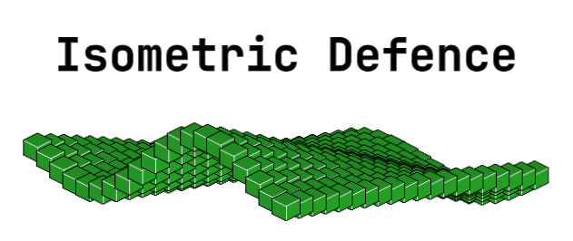
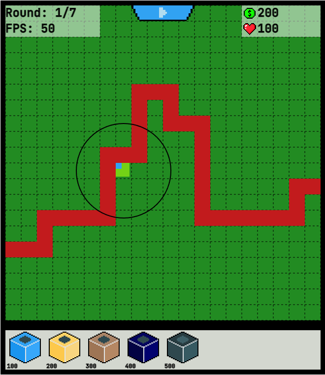
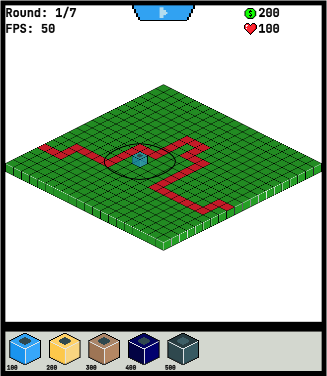

# Isometric-Defence
in cooperation with [@akatranlp](https://github.com/akatranlp)

<p align="center">
  
</p>


## Get started
To run the game, build the `src/Main.elm` file into `public/elm.js`, like
```bash
elm make src/Main.elm --output=public/elm.js
```

After that, you can open the `index.html` file in your browser.

The Game request an internal Tileset Image, so you have to host your own server (e.g. `python http.server`)
```bash
cd public
python3 -m http.server
```

Now you can open the game over `http://localhost:8000` 

Or open the game over GitHub-Pages on https://choffmann.github.io/isometric-defence/

## The Game

| TopDown                               | Isometric                                 |
|---------------------------------------|-------------------------------------------|
|  |  |

Tower-Defence Game developed in Elm. You can switch between TopDown- and Isometric View