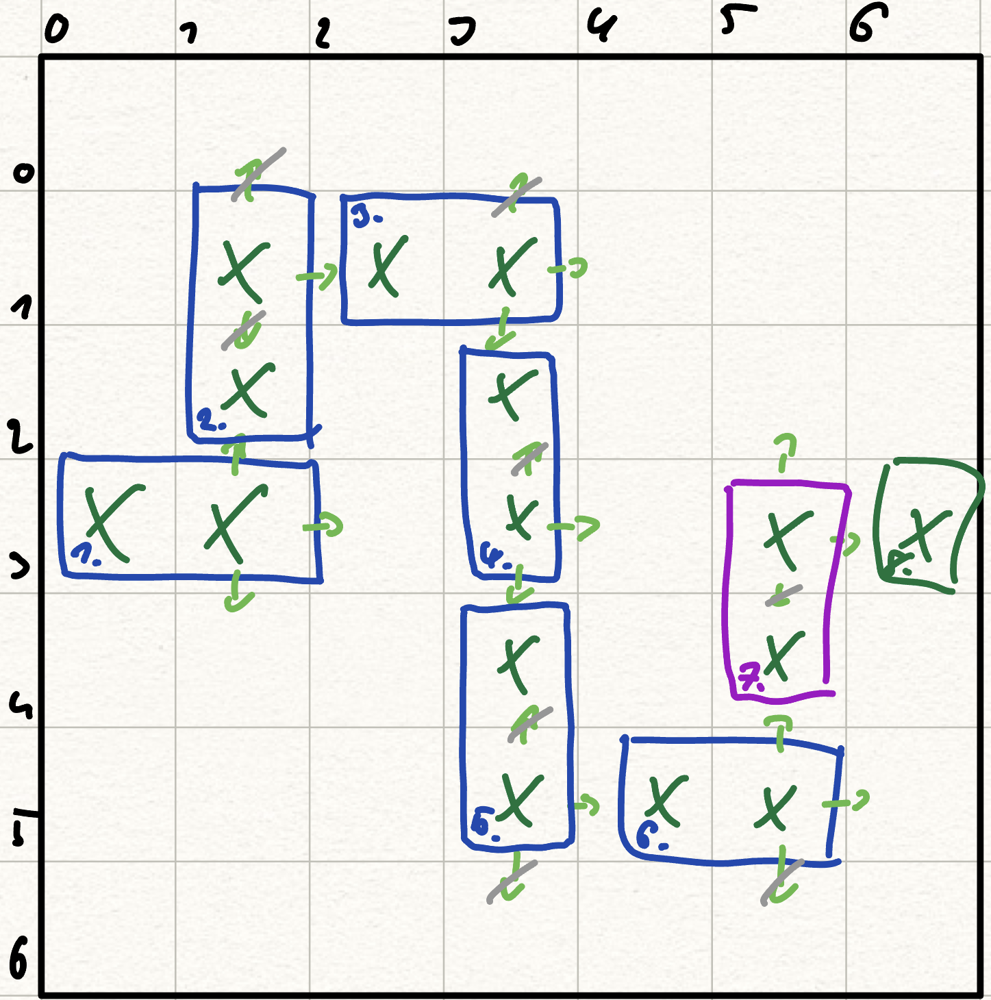

gegner:
    - Position {x: , y: }
    - Hitpoints: int
    - geschwindigkeit: int
    - worth (währung)
    - damage (wenn er durchkommt)
    - (resistent gegen?)

Turm:
    - damage (an gegner)
    - reichweite (radius)
    - position
    - kosten
    - angriffsgeschwindigkeit
    - 
    - (schadensart?)
    - (upgradekosten?)


type alias tower = {
    damage: Int, attackRadius: Int, position: Point,
    price: Int, attackSpeed: Float (angriffe/s)
}


state:
    - leben
    - geld
    - [gegnern]
    - path
    - [türmen]
    - Maybe Turm

Running, Paused, Lost, Won

## Pfad erstellung
Wird ein Punkt gesetzt, wird ein weiter Punkt in der entsprechenden Richtung mit erstellt. Dadurch wird sichergestellt, das wirklich ein Pfand erstellt wird und kein Zick Zack weg. Wird z.B. der Punkt `P(1,1)` in der Richtung `Right` erstellt, wird zudem ein Punkt `P(2,1)` mit erzeugt. Das Gleiche beim Erstellen des Punktes `P(2,3)` mit der Richtung `Up`. Hier wird zudem der Punkt `P(2,4)` erzeugt.

```elm
type PathDirection
    = Up
    | Down
    | Right
```
**Idee:**
1. Zufälliger Startpunkt 0..n an der Y-Achse. X-Achse bleibt am Startpunkt 0.
2. Nachbar wird erzeugt. `Direction: Right` (immer am Start)
3. Zufällige Auswahl einer Richtung vom letzten Punkt aus.
4. Prüfe, ob die Richtung verwendet werden kann. Z.B. ob der Pfad dann außerhalb der Area ist oder sich dort bereits ein Pfad befindet...
5. Wurde eine Richtung gewählt und ist valide, erstelle den neuen Punkt an der Position.
6. Nachtbar wird erzeugt. `Direction: <Gleiche wie avom vorherigen Punkt>`
7. Wiederhole Schritt 3. bis zum Endpunkt

**Ein Beispiel (Spielfeld 6x6 Felder):**
1. Der erste Punkt wird erzeugt. Wähle einen Punkt zwischen `P(0,0)` und `P(0,6)` aus (z.B. `P(0,3)`). Anschließend wird sein Nachbar mit der Richtung `Right` erzeugt (`P(1,3)`). Es bestehen somit aktuell die Punkte `[P(0,3), P(1,3)]`
2. Wähle vom letzten definierten Punk `P(1,3)` eine zufällige Richtung aus (`PathDirection`). Angenommen `Up` wird gewählt. Somit werden die Punkte `P(1,2)` und `P(1,1)` erzeugt. Es bestehen somit aktuell die Punkte `[P(0,3), P(1,3), P(1,2), P(1,1)]`
3. Es wird erneut eine zufällige Richtung gewählt. Richtung `Down` ist nicht möglich, da sich hier bereits ein Pfadelement befindet. Richtung `Up` ist nicht möglich, da hier der Nachtbarpunkt nicht erstellt werden kann (siehe durchgestrichene Pfeile in Abbildung). Es bleibt nur Richtung `Right` übrig. Der Punkt Rechts vom letzten Punkt `P(1,1)` aus wird erzeugt `P(2,1)` und dessen Nachtbar Punkt in der Richtung `Right` `P(3,1)`. Es bestehen somit die Punkte `[P(0,3), P(1,3), P(1,2), P(1,1), P(2,1), P(3,1)]`
4. _(bis 8.)_ Auswahl an Richtungen und erstellung von Punkten wird somit weitergeführt, bis ein Endpunkt am Ende des Spielfelds erzeugt wird.



Am Ende bestehen somit die Punkte `[P(0,3), P(1,3), P(1,2), P(1,1), P(2,1), P(3,1), P(3,2), P(3,3), P(3,4), P(3,5), P(4,5), P(5,5), P(5,4), P(5,3), P(6,3)]` mit `P(0,3)` als Startpunkt und `P(6,3)` als Endpunkt.
